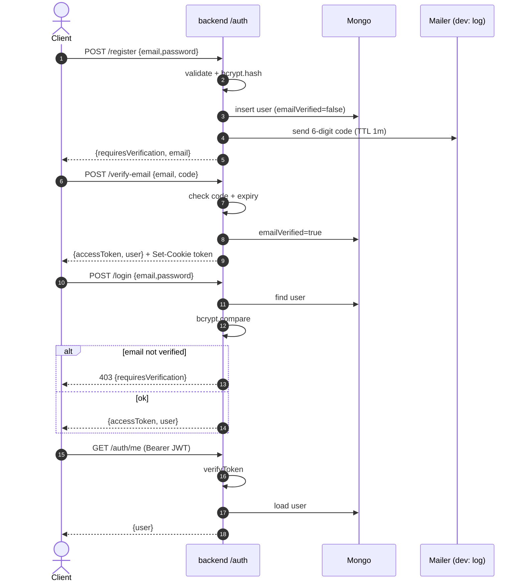
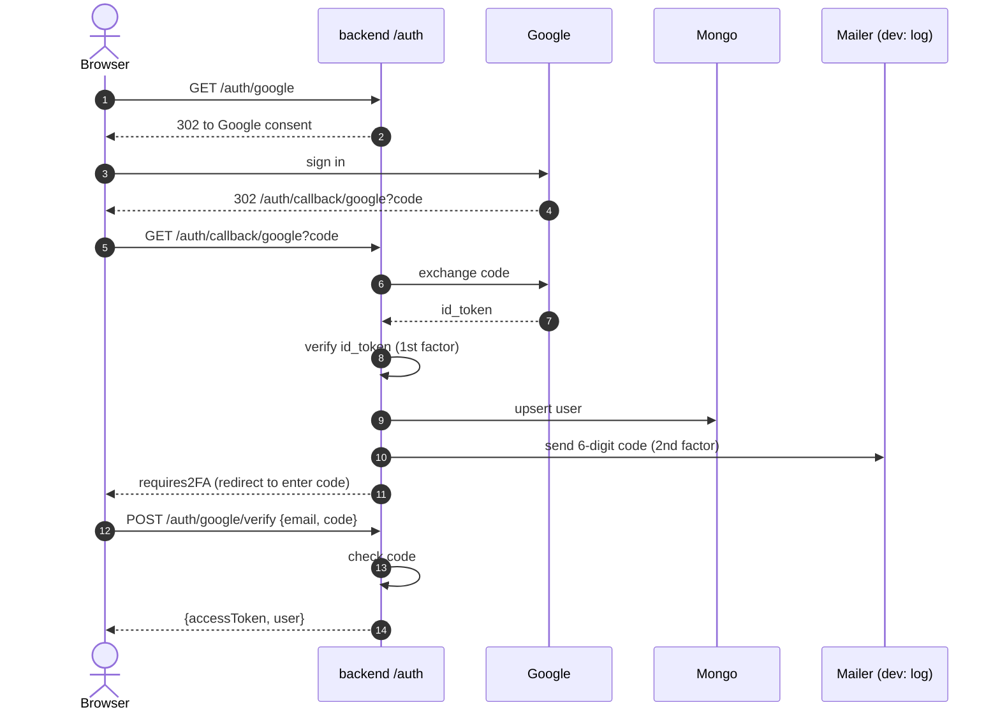
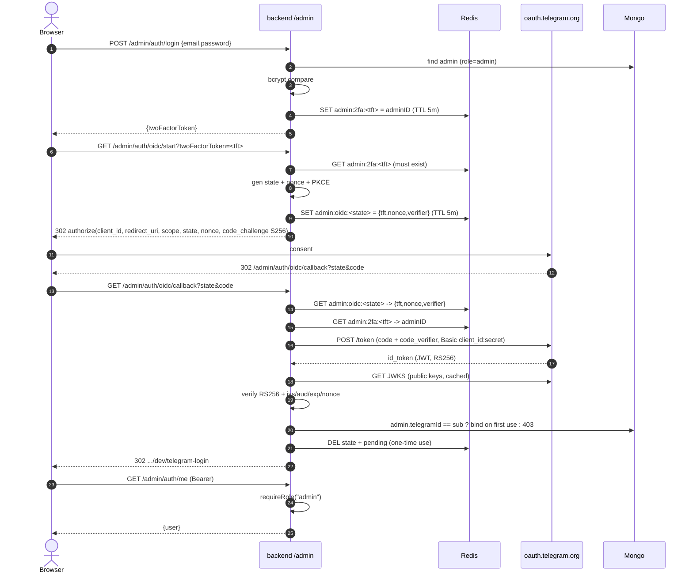

# Authentication & Authorization

Two independent systems, one shared JWT (HS256, `{userId,email,role,type}`, access 7d;
read from the `token` cookie then `Authorization: Bearer`). Passwords are bcrypt;
errors flow through `fault` (Kind → HTTP status). Users and admins live in the same
Mongo `users` collection; 2FA pending state lives in Redis.

---

## 1. User — email + password

---

## 2. User — Google (two-factor)

Google confirms identity (1st factor); a code emailed to the user is the 2nd factor.

---

## 3. Admin — password + Telegram OIDC

OpenID Connect (Authorization Code + PKCE, RS256). Only `role: admin`. The password
and Telegram steps are tied by a Redis pending token.

### Guarantees (admin flow)

| Mechanism | Protects against |
|---|---|
| password ⇄ Telegram tied by Redis pending token | completing 2FA without the password |
| id_token RS256, verified via Telegram JWKS (public key) | forged logins even if our server is compromised |
| `state` / `nonce` / PKCE | CSRF and replay |
| `admin.telegramId` (TOFU bind) | another Telegram account logging in as the admin |
| `DEL state + pending` after use | replaying the same `state`/code |
